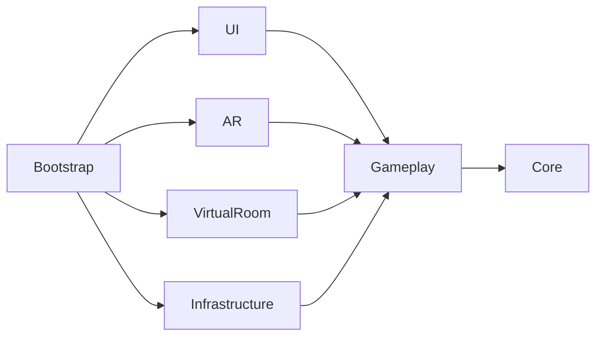
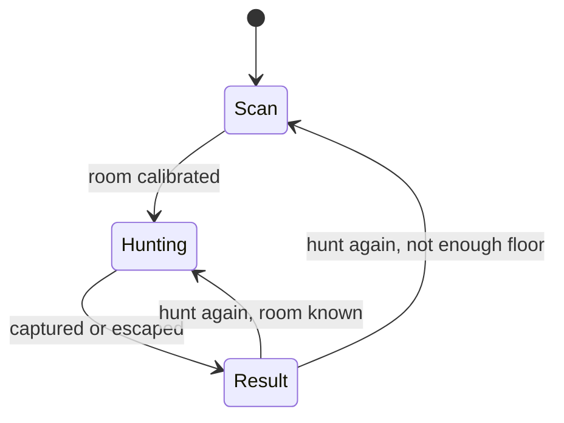

# Hauntscope: AR Ghost Camera

Your phone becomes a paranormal camcorder. Scan the room, track invisible ghosts by EMF and sound, reveal them through the Ghost Lens and trap them with the Capture Beam — before the battery dies.

An Android AR game built with Unity 6 and AR Foundation. No ARCore or no camera permission? The same hunt runs in a **Virtual Room** — a night-shot flat rendered in the style of camcorder footage.

<!-- GIF: AR hunt → Lens reveal → capture → the same ghost in the Virtual Room (recorded on device). -->

| | |
|---|---|
| Engine | Unity 6.3 LTS (6000.3.15f1), URP 17.3 |
| Platform | Android (ARCore optional), portrait |
| Architecture | VContainer DI, MVP, State, Strategy, Abstract Factory, Decorator, Adapter, Null Object, Repository, Object Pool |
| Async | UniTask with cancellation from lifetime scopes |
| Tests | 239 EditMode tests (NUnit) for all game logic |
| Assets | Ghosts, UI sprites, icons, SFX and VFX are **generated in code** |

## Features

- **AR hunt** — AR Foundation planes calibrate the room, ghosts wander inside its bounds and hide behind real furniture (ARCore depth occlusion).
- **Virtual Room** — a studio flat with a living room, kitchen and a bedroom behind a partition. Gyro + swipe to look, a floating joystick or tap to walk, collisions with walls and furniture. One HLSL shader turns the whole room into monochrome night-mode footage.
- **Tools** — EMF radar (beeps and haptics speed up as you get closer), Ghost Lens (drains the battery while on), Capture Beam (hold on the ghost until it dissolves).
- **Three ghosts, three behaviours** — a slow wisp, a poltergeist that teleports away when cornered, a shade that is only visible in flashes.
- **Camcorder HUD** — REC, timecode, battery, corner brackets, scanlines and grain; pause, tracking-lost and result screens.
- **Android runtime permissions** — camera permission with the "Don't ask again" path to app settings, ARCore availability and install flow, automatic fallback to the Virtual Room.
- **Localization** — Unity Localization with six locales (English and Ukrainian complete).
- **Persistence** — versioned JSON DTOs behind repositories.

## Architecture

### Layers

Every layer is an assembly definition, so the dependency rules below are enforced by the compiler.



| Assembly | Contains |
|---|---|
| `Core` | `StateMachine`, `ObservableValue<T>`, service interfaces (`ISaveService`, `IHaptics`, `ISfxPlayer`, `ILocalizationService`, …) |
| `Gameplay` | Domain logic: hunt flow, ghosts, tools, progress, ScriptableObject configs, **environment abstractions** (`IPlaneProvider`, `ICameraPose`, `ITrackingStatus`, `IOcclusionService`, `IArAvailability`, `ICameraPermission`) |
| `AR` | AR Foundation adapters |
| `VirtualRoom` | Virtual Room adapters, camera controller, joystick |
| `UI` | Passive Views and plain C# Presenters |
| `Infrastructure` | Save, haptics, audio pool, scenes, localization, permissions, app lifecycle |
| `Bootstrap` | `LifetimeScope`s only — the composition roots |

`Gameplay` knows nothing about AR Foundation, the Virtual Room, UI or concrete services. That single rule is what makes two environments share one game and what makes the logic testable without a device.

### One game, two environments (LSP / DIP)

The hunt only talks to interfaces. `HuntLifetimeScope` is the one place that decides which implementations are live:

```csharp
var environment = Parent.Container.Resolve<HuntLaunchOptions>().Environment;
_arRig.SetActive(environment == HuntEnvironment.Ar);
_virtualRig.SetActive(environment == HuntEnvironment.Virtual);
if (environment == HuntEnvironment.Ar)
    RegisterArEnvironment(builder);      // ArPlaneProvider, ArCameraPose, ArTrackingStatus, ArOcclusionService
else
    RegisterVirtualEnvironment(builder); // VirtualPlaneProvider, VirtualCameraPose, VirtualTrackingStatus, NullOcclusionService
```

`ArPlaneProvider`, `VirtualPlaneProvider` and the tests' `FakePlaneProvider` are interchangeable without a single `if (isVirtual)` in the game code.

### Hunt flow

`HuntFlow` owns a `StateMachine` with declarative transitions; states don't know about the machine.



The same pattern drives each ghost: `Wander → Alerted → Flee → Captured / Escaped`, plus `Scare` for jump scares.

### Patterns

| Pattern | Where | Why |
|---|---|---|
| Composition Root + DI | `ProjectLifetimeScope`, `MainMenuLifetimeScope`, `HuntLifetimeScope` | All wiring in one place; constructor injection everywhere else |
| MVP | `UI/*View` + `*Presenter` | Views are passive MonoBehaviours; presenters are plain C# that subscribe in `Start` and unsubscribe in `Dispose` |
| State | `StateMachine`, `Hunt/States`, `Ghosts/States` | Each phase is a class with `Enter/Tick/Exit`; transitions are data |
| Strategy | `IGhostAbility` (`TeleportAbility`, `BlinkAbility`), `ITool` (`GhostLens`, `CaptureBeam`) | New behaviour = new class, no `switch` on type |
| Abstract Factory | `GhostAbilityConfig.CreateAbility()` | Each ability's ScriptableObject builds its own strategy |
| Factory | `GhostFactory` | The only place a ghost is assembled |
| Observer | `ObservableValue<T>`, C# events | Models notify presenters; no global event bus |
| Adapter | `Ar*`, `Virtual*`, `AndroidHaptics`, `AndroidCameraPermission`, `UnityLocalizationService` | Third-party APIs only behind interfaces |
| Decorator | `SettingsAwareHaptics` | Adds the "vibration off" rule without touching `AndroidHaptics` |
| Null Object | `NullHaptics`, `NullOcclusionService`, `VirtualTrackingStatus`, `EditorCameraPermission` | Replaces `if (x != null)` and platform checks |
| Repository | `PlayerProgressRepository`, `SettingsRepository` | Domain models don't know about JSON; DTOs carry a `Version` |
| Object Pool | `PooledSfxPlayer`, `PooledVfxPlayer` | No allocations for per-frame sounds and effects |

### Adding a ghost ability without touching existing code (OCP)

```csharp
public sealed class PhaseAbility : IGhostAbility
{
    public void Tick(Ghost ghost, float deltaTime) { /* new behaviour */ }
}

[CreateAssetMenu(menuName = "Hauntscope/Abilities/Phase")]
public sealed class PhaseAbilityConfig : GhostAbilityConfig
{
    public override IGhostAbility CreateAbility() => new PhaseAbility();
}
```

Drop the config into a `GhostData.Abilities` list — `GhostFactory`, the ghost states and the UI stay unchanged. A new ghost is data only: a `GhostData` asset added to `GameConfig`.

## Tests

EditMode tests cover the pure logic: the state machine, observables, EMF radar, battery, toolbelt, lens and beam, room calibration, ghost selection and movement, every ghost state and transition, abilities, scare policy, pause, the AR/Virtual launch flow (`HuntLauncher`), and the repositories. Test doubles live in `Tests/EditMode/Fakes`.

Run them from **Window → General → Test Runner → EditMode**.

## Content generated in code

Everything original is reproducible from the repository via **Hauntscope → Build Assets**:

| Generator | Output |
|---|---|
| `GhostMeshGenerator` | Procedural ghost meshes |
| `UiSpriteGenerator` | SDF UI sprites in one style (frames, brackets, reticle, battery, scanlines, icons) |
| `SfxGenerator` + `AudioDsp` | Synthesised sound effects and ambience |
| `VfxGenerator` | Particle textures, materials and pooled VFX prefabs |
| `GhostIconGenerator`, `AppIconGenerator` | Bestiary icons and the launcher icon, rendered with the real ghost shader |
| `VirtualRoomBuilder` (**Hauntscope → Build Virtual Room**) | The Virtual Room prefab: collider shell, furniture layout, lights, baked lamp flicker |

Shaders are hand-written URP HLSL: `Ghost` (Fresnel rim, scrolling smoke, reveal and dissolve), `ParticleAdditive`, and `NightShot` (monochrome night-mode footage with grime, wall streaks and distance falloff).

## Getting started

1. Install Unity **6000.3.15f1** with Android Build Support.
2. Open the project and the `Assets/_Hauntscope/Scenes/MainMenu.unity` scene.
3. Press Play. In the Editor, AR runs on XR Simulation; the camera permission answer is set in `GameConfig → Launch` to try the denial flows.
4. To build: switch to Android, keep IL2CPP / ARM64, and build. ARCore is optional, so devices without it land in the Virtual Room.

## Credits and license

- Code: [MIT](LICENSE) © 2026 Pavko.
- Original art and audio: © 2026 Pavko, all rights reserved.
- Third-party assets and packages: see [CREDITS.md](CREDITS.md).

Hauntscope is a game for entertainment purposes only. It does not detect real paranormal activity.
